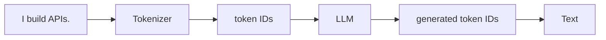

# Tokens: Why an LLM Does Not Read “Words”

Before we discuss cost or context, we need the unit an LLM works with: the **token**. A token is a chunk of text produced by a model's tokenizer. It may resemble a word, part of a word, punctuation, or whitespace. It is not a reliable synonym for a word or a character.

## The simple idea

When you type `I build APIs.`, the model does not receive an abstract sentence. Its tokenizer maps the text into token identifiers. The model processes those identifiers and predicts the next ones.

The exact split depends on the tokenizer. Languages, punctuation, code, whitespace, and unusual names can produce very different token counts. Therefore, never build a production limit around a folk rule such as “one token is four characters.” Use the tokenizer or usage data for your chosen model.

## Why engineers care

Tokens form the shared unit for:

- input size: instructions, history, documents, and a user's question;
- output size: the answer the model generates;
- context capacity: what may fit in one inference; and
- many API usage and pricing calculations.

### Input and output are separate measurements

Suppose an application sends 800 input tokens and the model generates 150 output tokens. The request used both. A model's context capacity also has to accommodate the answer you want back—not only what you send in.

> Token count is a property of the text **and the tokenizer**, not an intrinsic property of a sentence.

## A practical scenario

An application has a 10,000-token context capacity. It sends 7,500 tokens of instructions, chat history, and retrieved documents. Reserving 1,500 tokens for the answer leaves roughly 1,000 tokens of safety margin—not 2,500 tokens of unlimited input space.

This is why “the model supports a large context window” is not enough for design. You need a budget.

## Common mistake

**Mistake:** Treating token count as only a finance concern.

**Better model:** Token count is a correctness constraint first. If needed evidence does not fit in the request, the model cannot use it. Cost is an additional consequence.

## Check your understanding

1. Why can the same sentence have different token counts for different models?
2. Why should output space be reserved before selecting input context?

## Next

Tokens explain what is measured. Next, we distinguish the human-facing chat product from the programmable interface an application uses to construct those token-bearing requests.

**Source basis:** class transcript and companion notes; see the [source map](../references/llm-fundamentals.md).
