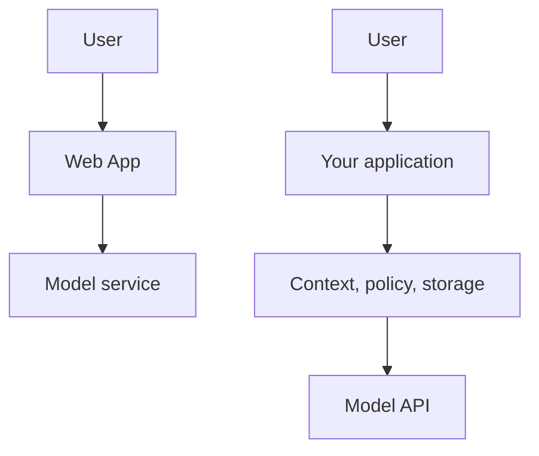

# ChatGPT Is a Product; an API Is a Building Block

Using a chat website and integrating a language model into your software are different activities.

## The distinction

| Concern | Web App | Model API |
| --- | --- | --- |
| Primary user | A person | Your software |
| Interface | Browser UI | Programmatic request/response |
| Conversation assembly | Product-managed and usually opaque | Your application owns the policy |
| Identity and access | Product account/session | Credentials, service controls, and your user model |
| Observability | Product-facing controls | Logs, metrics, tracing, and application analytics |
| Billing and limits | Plan-specific | Provider/model-specific usage terms |



The Web App is not “fake API access”; it is a complete product with its own behaviour and policies. An API is what you use when your product must decide what to send, who may access which data, how to record an interaction, and what should happen after an error.

## Request anatomy, without choosing a provider

An application commonly assembles something conceptually like this:

```json
{
  "instructions": "Answer as a concise support assistant.",
  "messages": [
    {"role": "user", "content": "Where is my invoice?"}
  ],
  "max_output_tokens": 300
}
```

This is illustrative JSON, not a copy-paste provider request. Actual names, message formats, token accounting, and authentication differ across APIs.

## The important ownership change

Once you build through an API, the hard questions become yours:

- Which instructions are trusted and always included?
- Which earlier messages are relevant enough to include?
- How do you avoid sending one user's data to another user?
- How do you handle timeouts, limits, and model failures?
- How do you measure token use and answer quality?

> A model API gives control; it also transfers engineering responsibility to the application.

## Pricing correction

“Web App is a buffet; API is pay-per-token” is a helpful classroom shortcut, not a contract. Plans, quotas, rates, cached inputs, credits, tools, and model availability vary. Verify the current terms for the provider and model you select.

## Next

The API makes a constraint visible: the model receives one assembled request at a time. That is the meaning of statelessness we need next.

**Source basis:** class transcript and companion notes; see the [source map](../references/llm-fundamentals.md).
