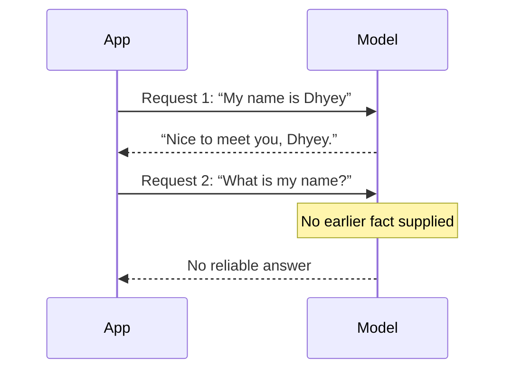

# Why an LLM Does Not Remember Your Previous Message

At inference time, an LLM generates from the information available for the current request. It does not carry a personal, mutable conversation state from one API call into the next.

## A two-message test

1. Send: “My name is Dhyey.”
2. In a new, isolated request, send: “What is my name?”

The second request contains no name. A stateless model has no reliable basis to answer it. A correct answer would require the application to include the relevant earlier fact in the second request.

## What “stateless” does and does not mean

| Statement | Correct? | Why |
| --- | --- | --- |
| “The model API call has no built-in conversation continuity.” | Yes | Each inference needs relevant context supplied or associated with it. |
| “A chatbot cannot remember anything.” | No | The surrounding application can persist and retrieve data. |
| “Stateless calls are always cheap.” | No | Cost follows the input and output tokens actually processed. |
| “A new chat means the request has zero context.” | No | It may still include instructions, profile data, tool definitions, or a summary. |

The word **model state** is useful here. A deployed model has learned parameters, but those parameters are not a per-user conversation diary. **Application state**—a database record, a session object, a cache, or an event stream—is where a product can persist user-specific information.

> Stateless inference is not the absence of state in the system. It is the boundary that tells us where state must live.

## A useful design question

For every fact your assistant appears to remember, ask:

1. Where is that fact stored?
2. Who is allowed to retrieve it?
3. Under what condition is it included in the next model request?
4. When should it expire or be deleted?

These are engineering and privacy decisions, not model magic.

## Next

We now know where continuity must live. The next chapter shows how an application can retrieve and assemble it into a model-visible conversation.

**Source basis:** class transcript and companion notes; corrected for application-managed context. See the [source map](../references/llm-fundamentals.md).
