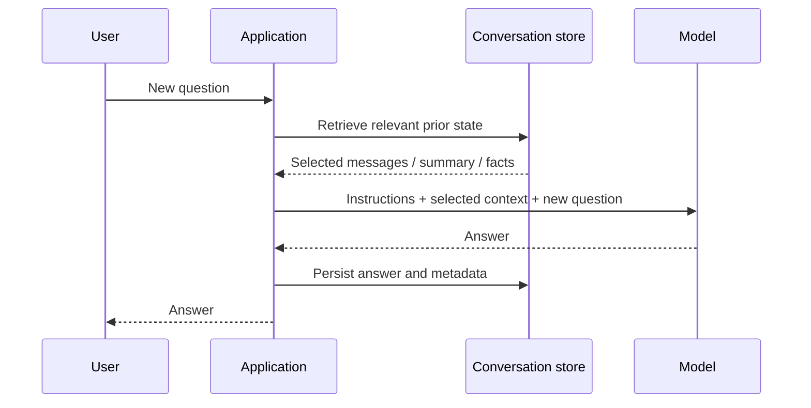

# A Conversation Is Rebuilt, Not Remembered

The model does not browse an application's database. A chatbot feels continuous only when the application selects relevant state and supplies it as part of the next inference.

## The reconstruction loop



The storage step and the prompt-assembly step are deliberately separate. Saving 5,000 messages is not the same as giving all 5,000 messages to the model.

## Three layers to keep separate

| Layer | Example | Responsibility |
| --- | --- | --- |
| Persistent history | Every message in a support ticket | Database/storage policy |
| Selected request context | System instructions, latest turns, ticket summary | Context-selection policy |
| Model output | The answer for this request | Inference |

An application may use full recent history for a short chat. As conversations grow, it may include a summary, a few relevant older facts, the latest turns, or a combination. It may also omit information that the user should not be allowed to access.

## A plain-Python representation

```python
messages = [
    {"role": "user", "content": "I moved from Pune to Mumbai."},
    {"role": "assistant", "content": "I can update the delivery address."},
]

request_context = [
    {"role": "system", "content": "Help with delivery support."},
    *messages,
    {"role": "user", "content": "Where will my next order go?"},
]
```

The list is a teaching representation. Production systems need validation, user isolation, retention rules, observability, and a model-specific adapter.

Run [`assemble_history.py`](../examples/llm-fundamentals/assemble_history.py) to see the distinction between stored history and the assembled request.

## A correction worth remembering

It is imprecise to say that every chat product “resends the entire history.” Different products may assemble full history, selected turns, summaries, retrieved facts, tool results, hidden instructions, or cached prefixes. Usually, a hosted product does not expose its exact policy.

The dependable statement is simpler:

> The model can use only the information that is included or made available in the current inference context.

## Next

Reconstruction creates a new constraint: the assembled context must fit inside a finite capacity.

**Source basis:** class transcript and companion notes; see the [source map](../references/llm-fundamentals.md).
