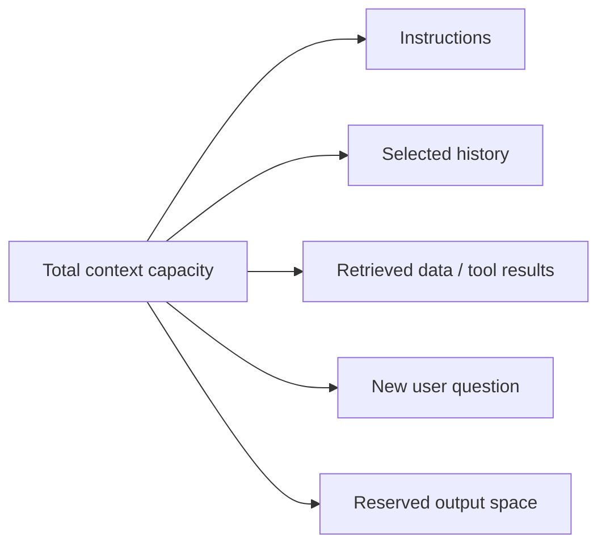

# The Context Window: The Model’s Finite Working Space

The **context window** is the maximum amount of tokenized information a model can use in one inference. Think of it as finite working space, not a permanent memory store.

## The budget

If the total capacity is 10,000 tokens, a sensible plan might reserve 1,000 tokens for the answer. The application then has a maximum of 9,000 tokens for everything else. This is a toy budget; exact API semantics vary.

## Capacity is not occupancy

These terms are often confused:

| Term | Meaning |
| --- | --- |
| Model context capacity | The maximum window the model supports for one inference |
| Request occupancy | Tokens in the request assembled right now |
| Output reserve | Tokens intentionally left for the model's answer |
| Session policy | The application's rules for retaining/selecting chat state |

The model capacity is a capability. The request occupancy is an application choice. A conversation may be short but still create a large request because of long instructions, documents, or tool definitions.

## What happens when the budget is exceeded?

There is no universal “the oldest message silently disappears” rule. A provider or application might:

- reject the request;
- truncate a part of the request;
- shorten an output allowance;
- summarise or select content before making the call; or
- require the developer to reduce input themselves.

That behaviour must be designed and tested for the exact API and workload. Silent trimming can be dangerous if it removes an instruction, a safety constraint, or the only document containing the answer.

## A toy example

Imagine a 40-token learning window. If the application fills 35 tokens with old messages and needs a 10-token answer, it cannot simply add a 5-token new question. It needs a policy: remove low-value turns, use a summary, choose relevant facts, or ask the user to narrow the request.

Run [`fit_messages_to_budget.py`](../examples/llm-fundamentals/fit_messages_to_budget.py) for a deterministic illustration of retaining the newest messages under a token budget.

> Context window is what the model can work with now. It is not proof that the model has remembered everything said before.

## Next

Even before the window fills, adding more context changes the token profile of every request. That makes long conversations an engineering problem.

**Source basis:** class transcript and companion notes; corrected for provider- and application-specific overflow behaviour. See the [source map](../references/llm-fundamentals.md).
