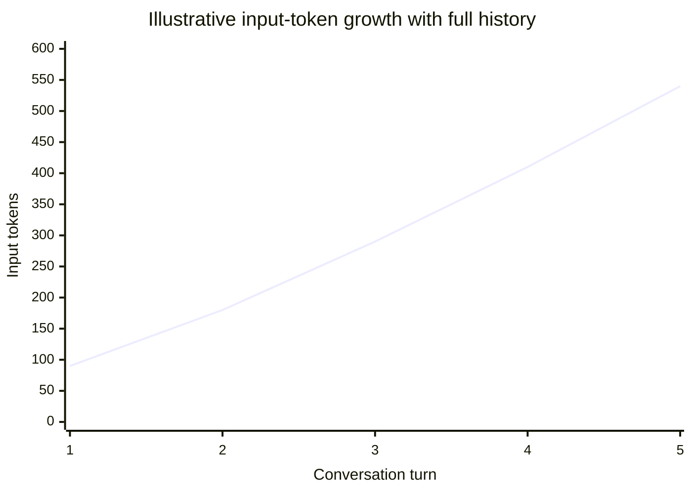

# Why a Long Conversation Becomes an Engineering Problem

The apparent convenience of “just keep sending the chat” eventually turns into a trade-off: each request has to carry enough context to be useful, but unnecessary context competes with the answer, reduces focus, and can increase input processing.

## What grows

With a full-history strategy, the request for turn 10 can include much of turns 1–9. The next request may include even more.

The graph is conceptual, not a provider benchmark. Real behaviour depends on the message sizes, context-selection policy, model, cache behaviour, and API implementation.

## The four costs of irrelevant context

| Cost | Why it matters |
| --- | --- |
| Capacity | Important new evidence may no longer fit. |
| Money | Many APIs meter input and output tokens, often differently. |
| Latency | Larger effective inputs can require more processing; measure your workload. |
| Quality | Old, conflicting, or irrelevant content can distract the model. |

## Context management is a policy

There is no globally best strategy. Common approaches include:

| Strategy | Strength | Main risk |
| --- | --- | --- |
| Keep recent turns | Simple and preserves immediate flow | Drops older commitments |
| Summarise earlier turns | Compresses a long narrative | Summary may lose nuance or introduce errors |
| Retrieve relevant facts | Good for targeted questions | Retrieval can miss the needed fact |
| Keep structured state | Precise for known fields, e.g. order ID | Needs schema and maintenance |
| Hybrid | Balances recent dialogue, summary, and facts | More policy and evaluation work |

For an order-support assistant, a strong policy might use: trusted system instructions, the latest two turns, a short ticket summary, and the currently authenticated order record. It should not blindly include every old greeting and unrelated issue.

## An important correction

Long chats are **not guaranteed** to become linearly slower or more expensive on every turn. Providers may cache repeated prefixes, and applications may select or compress context. But a larger, less focused context generally creates more pressure on capacity and relevance. Measure token usage, latency, error rate, and answer quality using representative conversations.

## A minimal decision rule

Before adding data to a request, ask:

1. Is it necessary to answer this exact question correctly?
2. Is it trustworthy and authorised for this user?
3. Does it displace something more important from the budget?

## Next

Careful history management solves continuity; it does not make a trained model current. Next, we separate past conversation from fresh world knowledge.

**Source basis:** class transcript and companion notes; see the [source map](../references/llm-fundamentals.md).
