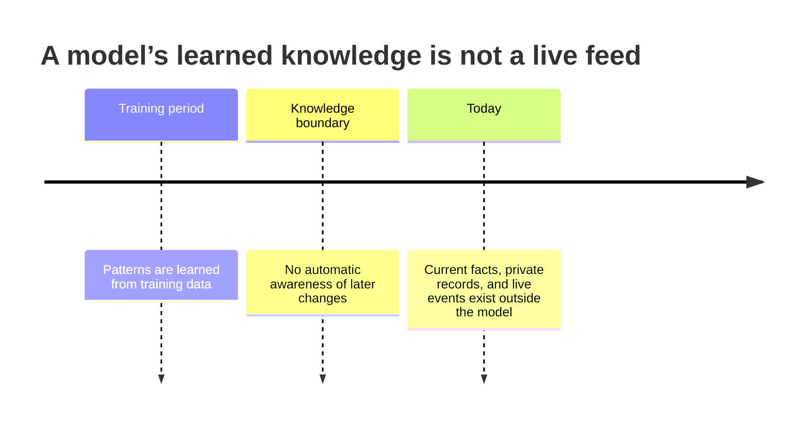
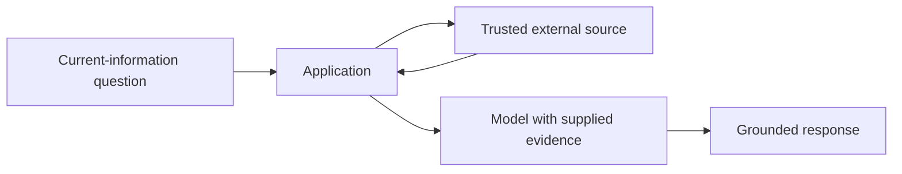

# Knowledge Cutoff: Why a Capable Model Can Still Be Out of Date

A model can write a fluent answer about a recent event and still be wrong. Fluency reflects language generation, not a guarantee that the information is current, complete, or applicable to your private system.

## The boundary

The word **cutoff** is shorthand for this boundary. It should not be treated as a precise promise that every fact before one date is known and every later fact is unknown. Training data coverage, model updates, and product capabilities all vary.

## Three kinds of questions

| Question | Can trained knowledge alone be enough? | What a reliable application may need |
| --- | --- | --- |
| “Explain HTTP status code 404.” | Often | Clear instructions and normal verification |
| “What is our current leave policy?” | No | Authorised company policy source |
| “What is today’s exchange rate?” | No | A current, trusted data source |

The second and third questions are not mainly a “bigger model” problem. They are an information-access and freshness problem.

## The solution belongs to the application

An application can provide current information through a search service, an internal database, a document-retrieval system, or a tool/API call. The model then reasons over the returned, authorised data.

This is a preview of later modules on retrieval and tools. Do not assume that web access, RAG, or tool use is an automatic property of every model or chat interface.

## Reliability habits

- State the source and timestamp where freshness matters.
- Prefer authoritative sources for business, medical, legal, financial, or operational decisions.
- Treat an unsupported “latest” answer as a signal to retrieve or verify, not as evidence.
- Keep access control in the application. A model should not receive a private document merely because a user asked a convincing question.

> Conversation history answers “what did we say before?” Live information answers “what is true now?” They are different problems.

## Module recap

An API call is stateless. Applications create continuity by storing and selecting state. The selected context must fit within a finite budget. And no amount of stored conversation automatically updates a model’s learned knowledge.

## Next module

**Working with LLM APIs**: request/response anatomy, roles, credentials, token usage, retries, and plain-Python chatbot construction.

**Source basis:** knowledge cutoff was requested scope rather than a substantive transcript topic. This chapter is intentionally conceptual; verify capability and freshness against the source your application uses.
