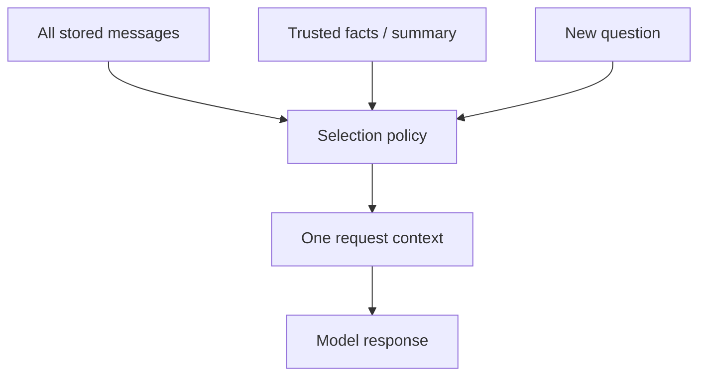
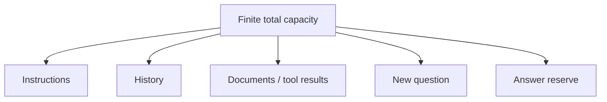
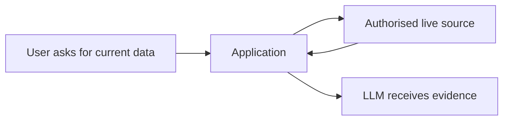

# Visualization Diagrams

The chapter diagrams are deliberately embedded beside the idea they explain. This page gathers the three diagrams that are most useful when revising the module.

## 1. Stored history is not model context

## 2. Context is a budget

## 3. Freshness needs a source

For the full teaching flow, start with the [module README](../../01-llm-fundamentals/README.md).
