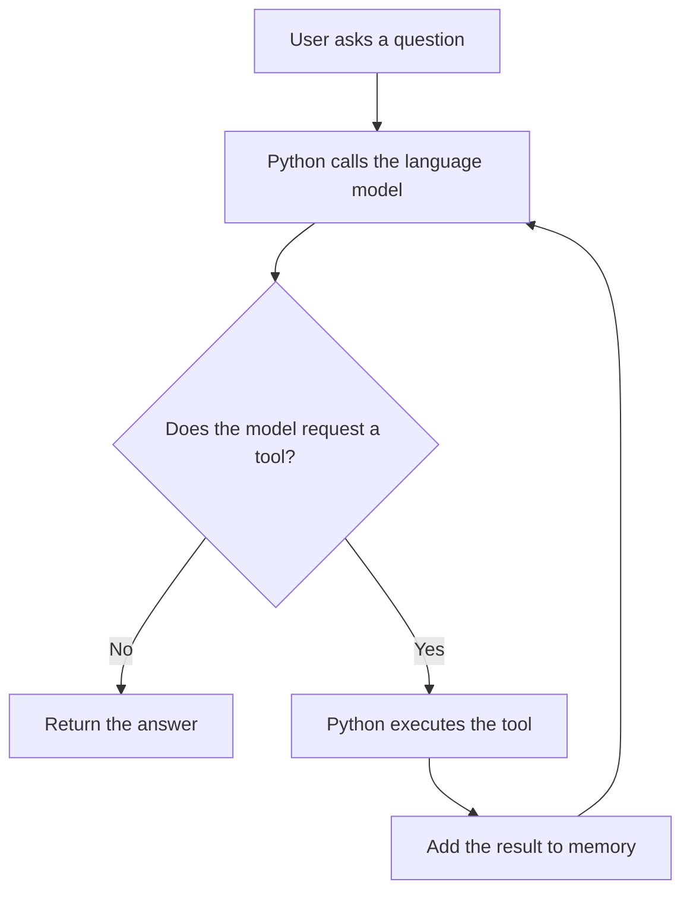

# AI Tool-Calling Agent in One Python File

This is a beginner-friendly project for understanding an AI agent before using
frameworks such as LangChain. All Python logic is intentionally kept inside
one file: [`main.py`](main.py).

The project is meant for study and demonstration—not as a production template.

## What will you learn?

You will see that an agent is not magic. It is mainly a loop connecting four
simple pieces:

1. Conversation memory
2. A language model
3. A normal Python function
4. A tool schema describing that function to the model



The model does not run `get_weather()`. It only requests that the function be
called. Python remains responsible for finding and executing the function.

## Files

```text
verbose-tool-agent/
├── main.py           # all Python code
├── pyproject.toml    # project details and dependencies
├── uv.lock           # exact dependency versions
├── .env.example      # API-key template
├── .gitignore
├── .python-version
├── LICENSE
└── README.md
```

## Prerequisites

- Python 3.11 or newer
- [`uv`](https://docs.astral.sh/uv/)
- One API key from Groq, OpenRouter, or OpenAI

## 1. Install the dependencies

```bash
uv sync
```

`uv` automatically creates the virtual environment and installs the versions
recorded in `uv.lock`.

## 2. Configure the API key

On macOS or Linux:

```bash
cp .env.example .env
```

On Windows PowerShell:

```powershell
Copy-Item .env.example .env
```

Open `.env` and fill in one API key. Never put the key directly in `main.py`
and never commit `.env` to Git.

## 3. Run the project

Start an interactive conversation:

```bash
uv run python main.py
```

Ask one question and exit:

```bash
uv run python main.py "What is the weather in Delhi?"
```

The default output deliberately prints the conversation and agent steps. This
makes the otherwise hidden execution flow easier to understand.

Print only the answer:

```bash
uv run python main.py --quiet "What is the weather in Tokyo?"
```

Test the local Python logic without an API key:

```bash
uv run python main.py --self-test
```

## How to study `main.py`

Read the numbered sections in order:

1. `get_weather()` — a normal Python function
2. `TOOL_SCHEMAS` — the description shown to the model
3. `get_client_and_model()` — provider selection
4. Printing helpers — visibility into execution
5. `run_agent()` — the actual agent loop
6. Terminal interface — how a user interacts with the loop

Do not begin by memorising the code. Follow how the `messages` list changes.
That list is the key to understanding why the model can use a tool result only
on the next call.

## Important limitation

The weather is fixed sample data, not live weather. This is intentional because
the goal is to isolate and understand tool calling. Production systems also
need timeouts, retries, structured logging, persistent memory, authentication,
rate limiting, observability, and stronger tool permissions.

## Suggested GitHub description

> A single-file Python project for learning how an LLM agent calls tools,
> without LangChain or another agent framework.
