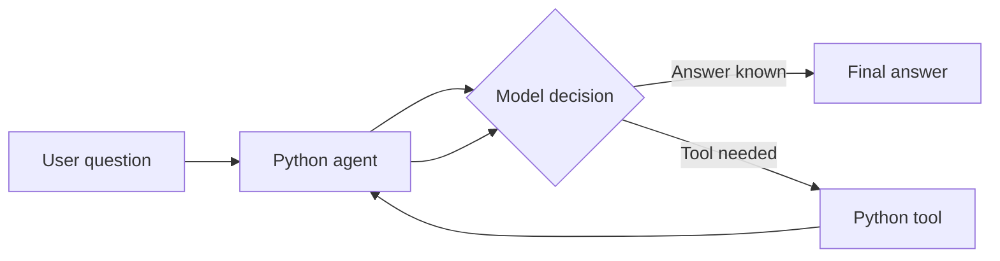

# Build Your First Tool-Calling AI Agent in Pure Python

> Learn what happens inside an AI agent before a framework hides the details.

This project teaches one important idea: **an AI model becomes more useful when it can
request a normal Python function, receive its result, and continue answering.**

You do not need LangChain, LangGraph, or an API key to begin. Demo mode runs entirely on
your computer and makes every step visible.

## What you will build



The included weather values are intentionally fixed sample data. The lesson is tool
calling—not weather forecasting.

## Start in two minutes

Requirements: Python 3.12 or newer. No package installation is required.

```bash
python main.py "What is the weather in Pune?"
```

Try a question that does not need a tool:

```bash
python main.py "Explain what an AI agent is"
```

Run the built-in checks:

```bash
python main.py --self-test
```

With `uv`, the equivalent commands are:

```bash
uv run python main.py "What is the weather in Tokyo?"
uv run python main.py --self-test
```

## What to watch while it runs

Do not begin by memorising the code. Watch the `messages` list change:

1. The user question enters the list.
2. The model requests a tool.
3. Python executes that tool.
4. The tool result enters the list.
5. The model reads the result and writes the final answer.

That second model call is the detail beginners most often miss.

## Learning path

| Step | Lesson | Main question |
|---:|---|---|
| 1 | [From program to agent](docs/01-from-python-program-to-ai-agent.md) | What makes an agent different? |
| 2 | [Understanding tools](docs/02-understanding-tools.md) | How does a Python function become a tool? |
| 3 | [Tool selection](docs/03-how-the-model-selects-a-tool.md) | Who decides whether a tool is needed? |
| 4 | [The agentic loop](docs/04-understanding-the-agentic-loop.md) | Why must the model be called again? |
| 5 | [Messages and memory](docs/05-conversation-history-and-memory.md) | What does the model actually remember? |
| 6 | [Code walkthrough](docs/06-complete-code-walkthrough.md) | How do the code sections cooperate? |
| 7 | [Guided practice](docs/07-guided-practice.md) | Can I modify the agent myself? |

## Visual learning material

- [Agent components](visualizationDiagram/agent-components.md)
- [Tool-calling sequence](visualizationDiagram/tool-calling-sequence.md)
- [Message-history growth](visualizationDiagram/message-history-growth.md)
- [Complete agent loop](visualizationDiagram/complete-agent-loop.md)
- [Handwritten-style notes](Handwrittennotes/README.md)
- [Sticky-note revision cards](StickyNotes/remember-these-concepts.md)

## Optional: connect a real model

Demo mode is the recommended starting point. When the flow is clear, set these environment
variables in your terminal:

```bash
export AGENT_MODE=api
export MODEL_API_KEY="your-key"
export MODEL_NAME="gpt-4.1-mini"
export MODEL_BASE_URL="https://api.openai.com/v1"
python main.py "What is the weather in Pune?"
```

On Windows PowerShell, replace `export NAME=value` with `$env:NAME="value"`.

The API mode uses the OpenAI-compatible `/chat/completions` protocol and only Python's
standard library. Never commit a real API key.

## Repository boundaries

This is a focused teaching project. It explains the mechanics of a basic tool-calling agent.
It deliberately avoids framework abstractions, interview preparation, and unrelated system
design material so that the central idea stays visible.

