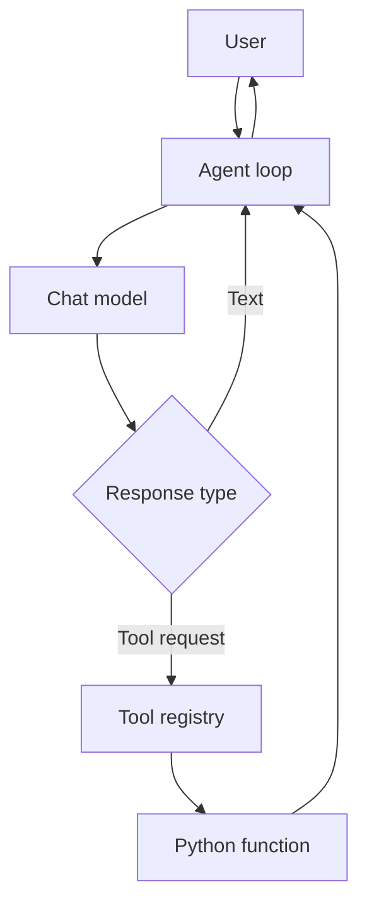

# Visual: Components of the Agent

| Component | Project location | Job |
|---|---|---|
| Model | `DemoModel` / `OpenAICompatibleModel` | Select an action or answer |
| Schema | `TOOL_SCHEMAS` | Describe available actions |
| Registry | `TOOL_REGISTRY` | Resolve approved function names |
| Tool | `get_weather()` | Perform the action |
| Loop | `run_agent()` | Move messages between components |

