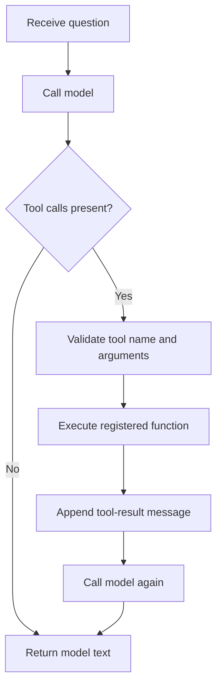

# Visual: Complete Agent Loop

```mermaid
flowchart TD
    Q[Receive question] --> C[Call model]
    C --> D{Tool calls present?}
    D -->|No| O[Return model text]
    D -->|Yes| V[Validate tool name and arguments]
    V --> E[Execute registered function]
    E --> H[Append tool-result message]
    H --> C2[Call model again]
    C2 --> O
```

The second model call is necessary because executing a tool changes what information is
available.

