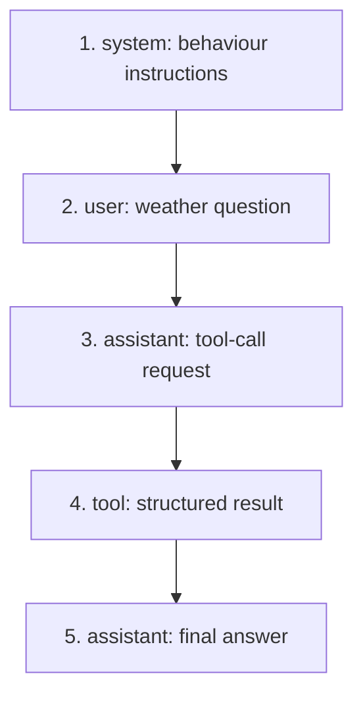

# Visual: How the Message List Grows

```mermaid
flowchart TB
    S1["1. system: behaviour instructions"]
    S2["2. user: weather question"]
    S3["3. assistant: tool-call request"]
    S4["4. tool: structured result"]
    S5["5. assistant: final answer"]
    S1 --> S2 --> S3 --> S4 --> S5
```

The chronological order matters. The tool result is linked to the assistant's request through
its `tool_call_id`.

