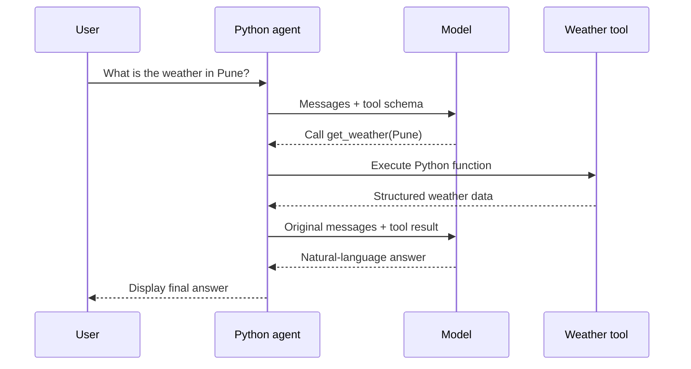

# Visual: Tool-Calling Sequence

```mermaid
sequenceDiagram
    participant U as User
    participant A as Python agent
    participant M as Model
    participant T as Weather tool

    U->>A: What is the weather in Pune?
    A->>M: Messages + tool schema
    M-->>A: Call get_weather(Pune)
    A->>T: Execute Python function
    T-->>A: Structured weather data
    A->>M: Original messages + tool result
    M-->>A: Natural-language answer
    A-->>U: Display final answer
```

The model never executes Python. The agent owns execution and returns the result to the model.

