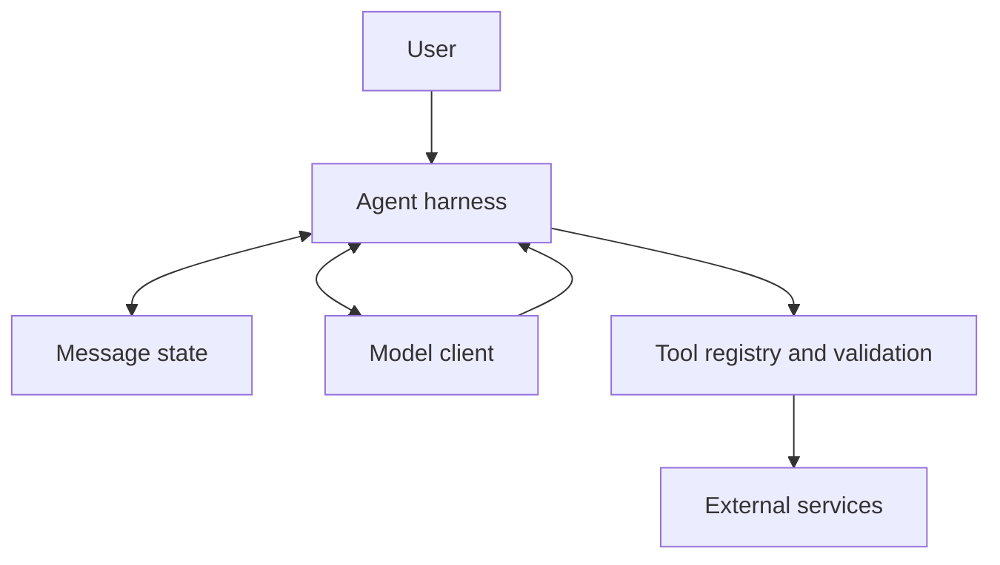

# Where Does the Agent End and the Application Begin?

The agent is not a single object living inside the LLM. It is a set of application components with clear responsibilities.

## Responsibility map

| Component | Owns | Must not be assumed to own |
|---|---|---|
| Model | Text generation and tool-call proposals | Python execution, credentials, permissions, durable memory |
| Harness | Loop control, request assembly, stop conditions | Truth of an external system’s response |
| Message store | Conversation and tool-result state | Unlimited retention or automatic relevance |
| Tool registry | Allowed names, argument validation, dispatch | Model intent or user authorization by itself |
| External service | Source-specific data/action | A safe explanation for the user |

## Why this separation matters

It lets you change a model provider without rewriting all business tools. It lets you test an agent loop with fake tools. It gives security controls a home: credentials should stay in the tool layer, and authorization should happen before a tool runs.

It also prevents an attractive but dangerous misconception: an LLM has no direct access to a local function merely because its name appears in a prompt. Your code crosses that boundary explicitly.

## A control-tower analogy

The model is like a planner suggesting what should happen next. The harness is the control tower that checks rules and dispatches work. The tool registry is the approved-services list. The message state is the flight log. The external service is the actual airport operation.

The control tower does not blindly obey a request, even from an excellent planner.

## Next step

Once the components are separated, the runtime sequence becomes much easier to reason about: ask, inspect, validate, execute, record, and ask again.

**Source basis:** S1, S2, S3. See the [source map](references/source-map.md).
