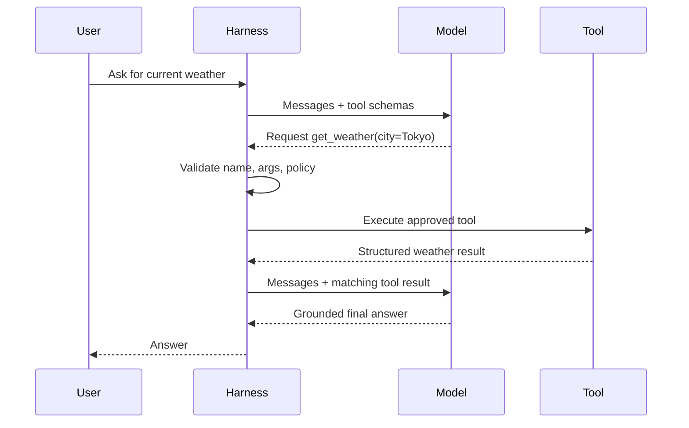

# Why Does an Agent Need a Loop?

A tool result is usually raw evidence, not a user-facing answer. The agent needs another model call so the model can interpret the evidence in the conversation’s context.

## The direct-answer path

For “Explain what a Python dictionary is,” the model can answer directly:

1. append the user message;
2. call the model;
3. append and return its text answer.

## The tool path

For “What is the weather in Tokyo?” the harness runs a longer path:

The harness repeats this cycle only while the response contains permitted tool-call requests. Models may request multiple calls in one response, so production code should handle each call and preserve each corresponding ID.

## Bound the loop

`max_turns` prevents endless model–tool cycling, but it is not sufficient on its own. A controlled agent also needs:

- overall time and cost budgets;
- per-tool timeouts and retries appropriate to the tool;
- argument and authorization checks;
- clear handling for tool errors and unavailable data;
- logging and tracing of calls, results, and stop reasons; and
- idempotency or approval gates for external side effects.

Caching is a separate freshness decision. Caching a stable reference lookup can be sensible; caching a stock price, account balance, or action result without a clear policy can be wrong.

## Agentic loop versus workflow

A **workflow** follows application-defined steps: validate a form, create a ticket, notify a team. An **agentic loop** allows the model to propose the next approved action based on current context. Many real systems combine both: deterministic workflows for critical processes and bounded agent steps where interpretation is useful.

Do not treat “agent” as a promise of unrestricted autonomy. Controlled autonomy is the engineering goal.

## Next learning bridge

You now understand the mechanics. The next module can focus on the provider protocol that makes this loop real: API requests, message roles, response objects, and structured tool-calling outputs.

**Source basis:** S1, S2, S3. See the [source map](references/source-map.md).
