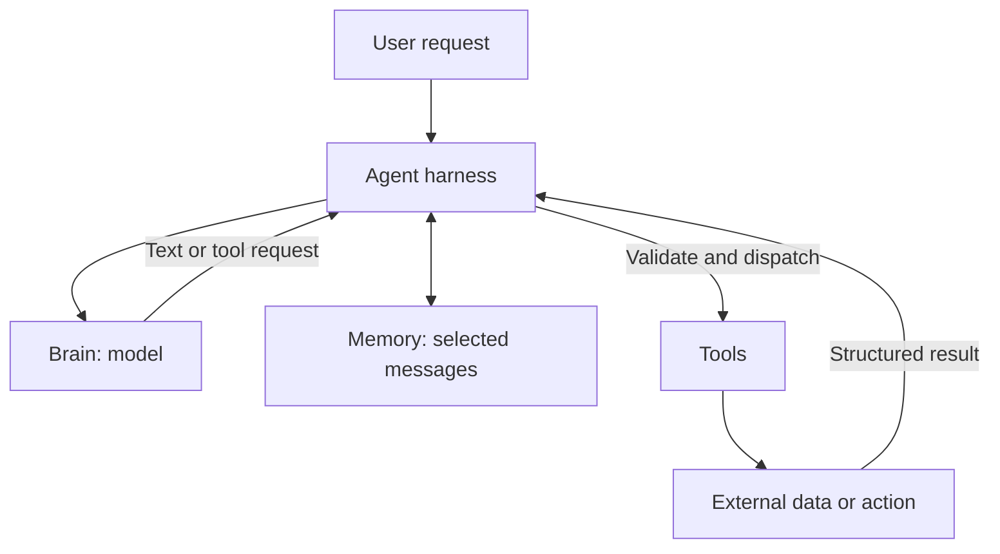

# Agent Components

```mermaid
flowchart TD
    A[User request] --> H[Agent harness]
    H --> B[Brain: model]
    H <--> M[Memory: selected messages]
    B -->|Text or tool request| H
    H -->|Validate and dispatch| T[Tools]
    T --> E[External data or action]
    E -->|Structured result| H
```

The model never calls the external service directly. The harness controls the boundary.
