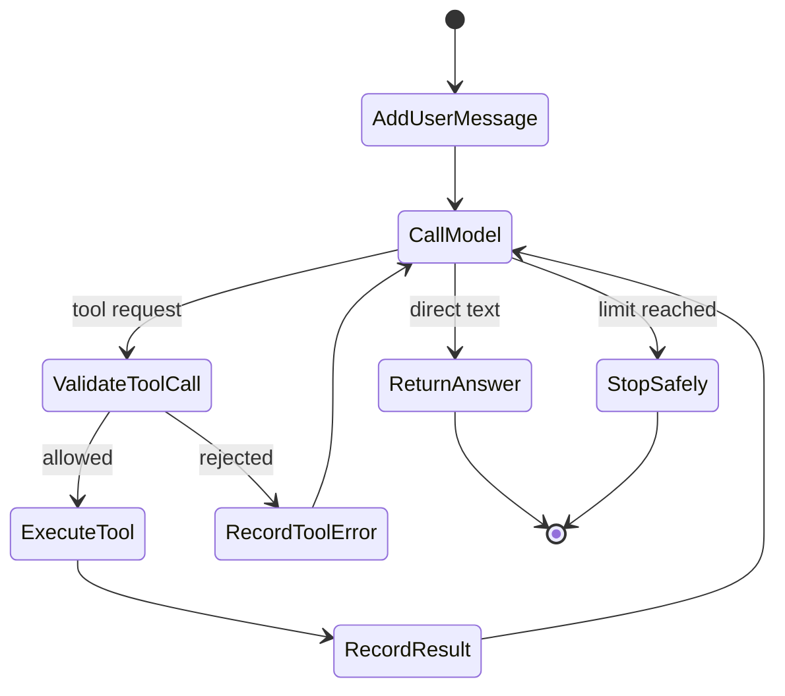

# Bounded Agent Loop

```mermaid
stateDiagram-v2
    [*] --> AddUserMessage
    AddUserMessage --> CallModel
    CallModel --> ReturnAnswer: direct text
    CallModel --> ValidateToolCall: tool request
    ValidateToolCall --> ExecuteTool: allowed
    ValidateToolCall --> RecordToolError: rejected
    ExecuteTool --> RecordResult
    RecordToolError --> CallModel
    RecordResult --> CallModel
    CallModel --> StopSafely: limit reached
    ReturnAnswer --> [*]
    StopSafely --> [*]
```

Maximum turns is one control. Timeouts, permissions, budgets, and logging are separate controls.
