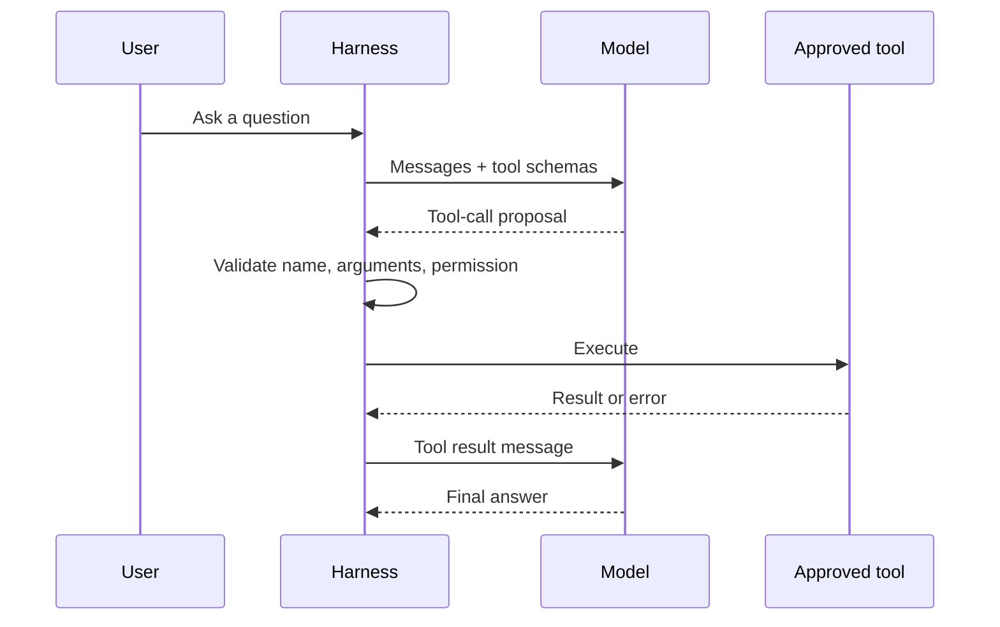

# Tool-Calling Sequence

```mermaid
sequenceDiagram
    participant U as User
    participant H as Harness
    participant M as Model
    participant T as Approved tool
    U->>H: Ask a question
    H->>M: Messages + tool schemas
    M-->>H: Tool-call proposal
    H->>H: Validate name, arguments, permission
    H->>T: Execute
    T-->>H: Result or error
    H->>M: Tool result message
    M-->>H: Final answer
```

The model proposes. The application validates and executes.
