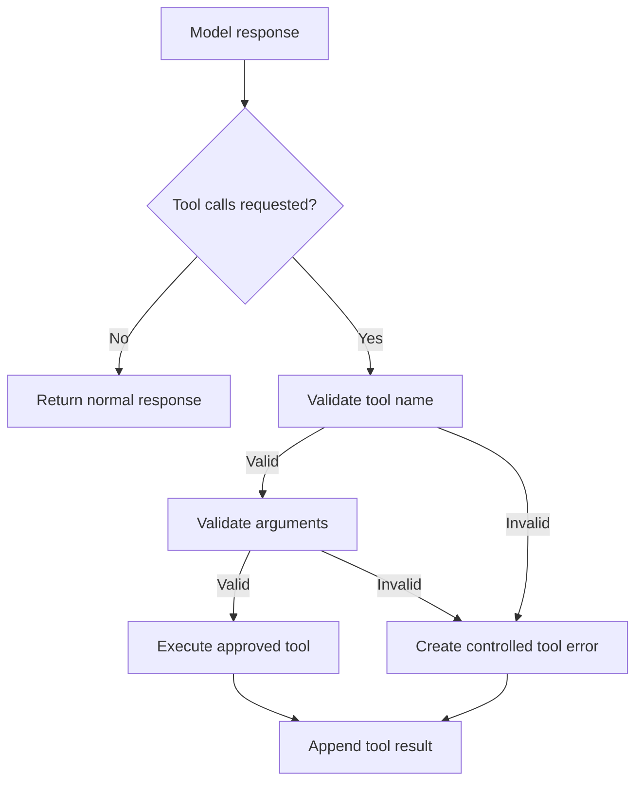

# The Model Can Request a Tool. Who Actually Runs It?

After receiving messages and tool schemas, a model can return either a normal response or a structured request to use a tool. That is **tool selection**. It is not **tool execution**.

## The important boundary

```text
Model: “I recommend get_weather(city='Tokyo').”
Application: “I will decide whether that named tool and those arguments are allowed, then run it.”
```

The model produces data. The application turns permitted data into an action.

## A minimal local registry

```python
TOOLS_BY_NAME = {
    "get_weather": get_weather,
    "get_time": get_time,
}
```

The registry is intentionally boring. It makes the allowed capability set explicit. Never convert a model-provided string into a Python callable through `eval`, dynamic imports, or unrestricted attribute access.

## Execution path

When the model returns a tool request, the application should:

1. Read the requested tool name and structured arguments.
2. Check that the name exists in the local allow-list.
3. Validate argument types, required values, and business constraints.
4. Execute the callable with a timeout and appropriate error handling.
5. Serialize the result into a tool-result message.



## Validation is not optional polish

A model can choose an unavailable tool, provide malformed JSON, omit a required field, or ask for a value outside your business rules. A schema helps the model choose well; runtime validation protects the system when it does not.

For example, a booking tool should validate more than JSON shape:

- Is the user authorised to book for this account?
- Is the date valid and available?
- Is a confirmation step required before creating a real booking?

Those are application policies. They cannot be delegated safely to a tool description.

## One request may contain several calls

The class material introduces a weather example with one call, but a provider may return multiple calls in one model turn. The agent should handle each call independently, preserve each call ID, and re-invoke the model only after the corresponding tool results are available.

## What this chapter does not solve

Executing a tool yields raw data or an action outcome. It does not automatically provide a clear answer to the user. The agent needs to add that result to its state and ask the model what to do next.

## Sources

- [Source map](references/source-map.md#tool-selection-and-execution)
- Previous: [Tool schemas](04-tool-schemas-and-structured-arguments.md)
- Next: [The agentic loop](06-the-agentic-loop.md)
