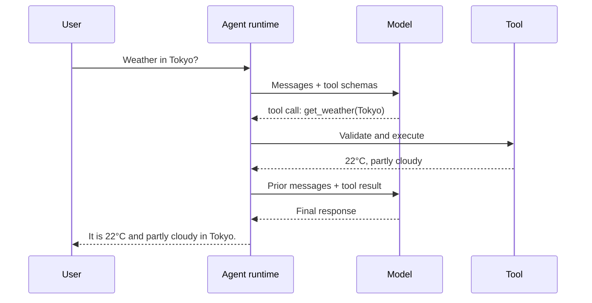
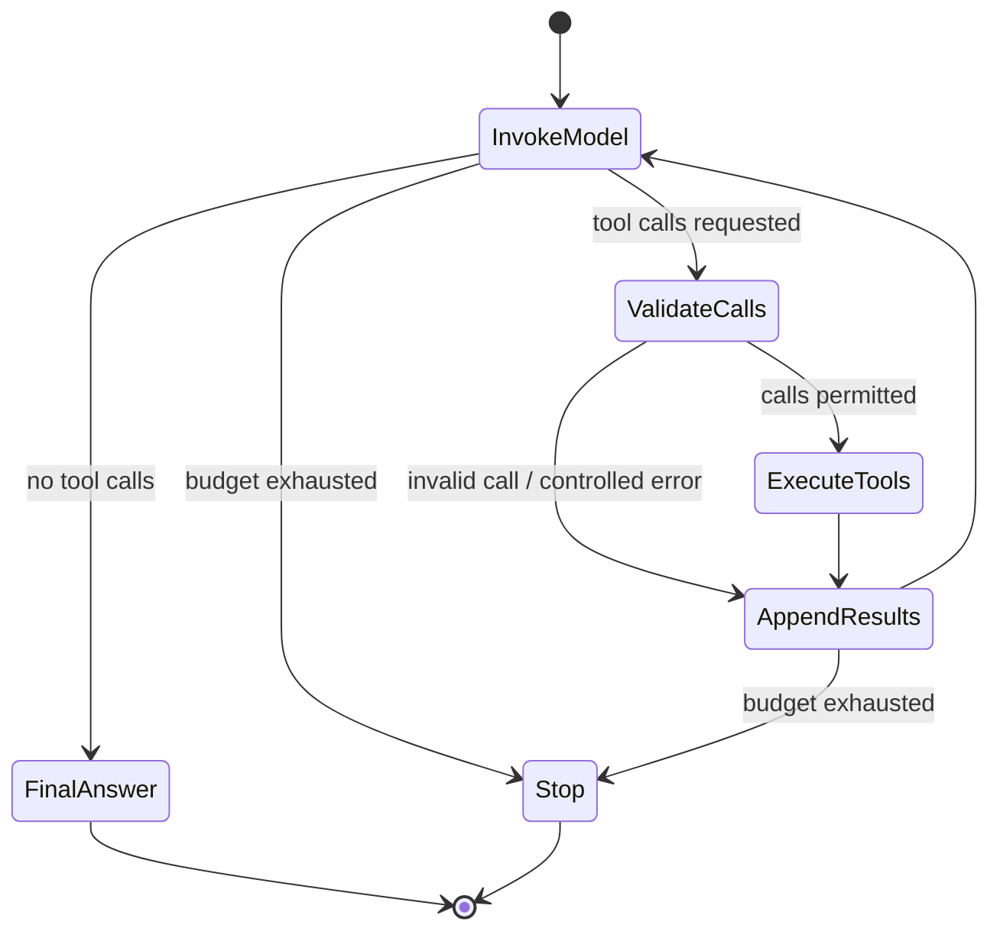

# What Turns Tool Calling into an Agent?

A one-off tool call is useful, but it is still incomplete. An agent needs a control loop that can inspect the model's decision, execute approved work, update state, and continue until there is a final outcome.

## The loop in one sentence

> Invoke the model, execute any requested tools, append their results, then invoke the model again until a terminal condition is reached.

## Execution flow



## The loop is a state machine

The model is one participant in the loop. The application owns the state machine.



## Minimal pseudocode

```python
for _ in range(max_iterations):
    response = model.invoke(messages, tools=tool_schemas)
    messages.append(as_assistant_message(response))

    if not response.tool_calls:
        return response.content

    for call in response.tool_calls:
        result = execute_validated_call(call)
        messages.append(as_tool_message(call.id, result))

return "Stopped before a final answer was produced."
```

The important details are deliberately visible:

- the assistant tool-call message is retained;
- every tool result is added to the ordered message list;
- a final natural-language response ends the loop;
- the runtime, not the model, enforces the iteration limit.

## Why the loop exists

Without this loop, a model could tell a human developer which tool to call. The developer would then execute it manually and paste the result back. That is a demonstration of tool calling, not an agent.

The loop moves this orchestration into the application while preserving the application's control over what can run.

## A practical example

Run the dependency-free implementation:

```bash
python examples/agentic-loop/main.py
```

It prints the message trail so that the tool request, tool result, re-invocation, unknown-tool handling, and bounded termination remain visible.

## What the loop does not solve

Repeated execution can consume money, time, and external-system capacity. It also creates the question: why call the model again after a tool returns a value? The next two chapters answer those questions.

## Sources

- [Source map](references/source-map.md#agentic-loop)
- Previous: [Tool selection and execution](05-tool-selection-and-execution.md)
- Next: [Calling the model again](07-calling-the-model-again-after-tool-execution.md)
