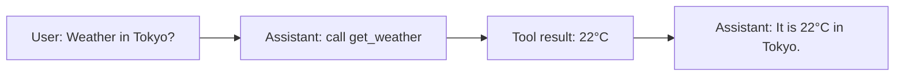

# Why Call the Model Again After a Tool Returns?

Suppose a weather tool returns this JSON:

```json
{"city": "Tokyo", "temperature_c": 22, "condition": "partly cloudy"}
```

That is useful machine data. It is not necessarily a complete response to the user, and it may not be the end of the work. The model needs to see the result before it can explain it, compare it, ask for another tool, or safely finish.

## The message protocol matters

A normal tool interaction contains at least four logical records:

| Order | Message | Meaning |
| --- | --- | --- |
| 1 | User message | The user asks for help. |
| 2 | Assistant tool-call message | The model requests a named tool and arguments. |
| 3 | Tool-result message | The application records the output for that exact request. |
| 4 | Assistant final message | The model uses the tool result to answer or choose another action. |

The tool-result message must be linked to the originating request through a provider-specific call identifier such as `tool_call_id`. This becomes essential when one model response contains multiple tool calls.



## Why returning the raw result is weaker

Directly returning raw tool output may work for a tiny demo, but it loses the model's ability to:

- translate technical data into the user's requested format;
- combine results from several tools;
- apply instructions already present in the conversation;
- decide whether another tool call is needed;
- explain a controlled tool failure clearly.

The model still does not become the executor. It receives an observation from the application and decides the next conversational step.

## Tool results can be errors too

An unknown tool, validation failure, timeout, or permission denial should become a controlled result—not an unhandled crash or a fabricated success. The application appends that outcome, and the model can produce a useful, honest response such as “I do not have access to currency conversion in this assistant.”

## History is working state, not automatic long-term memory

The growing message list is the immediate state needed by the loop. It only remains available while the application retains it, and it must still fit within the provider's context window. Durable conversation memory and context management are separate design concerns.

## Sources

- [Source map](references/source-map.md#calling-the-model-again)
- Previous: [The agentic loop](06-the-agentic-loop.md)
- Next: [Stopping conditions](08-stopping-conditions-and-maximum-iterations.md)
