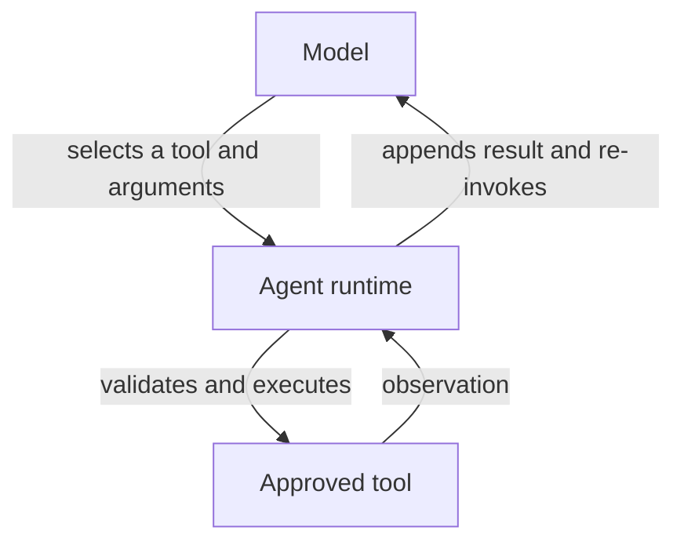
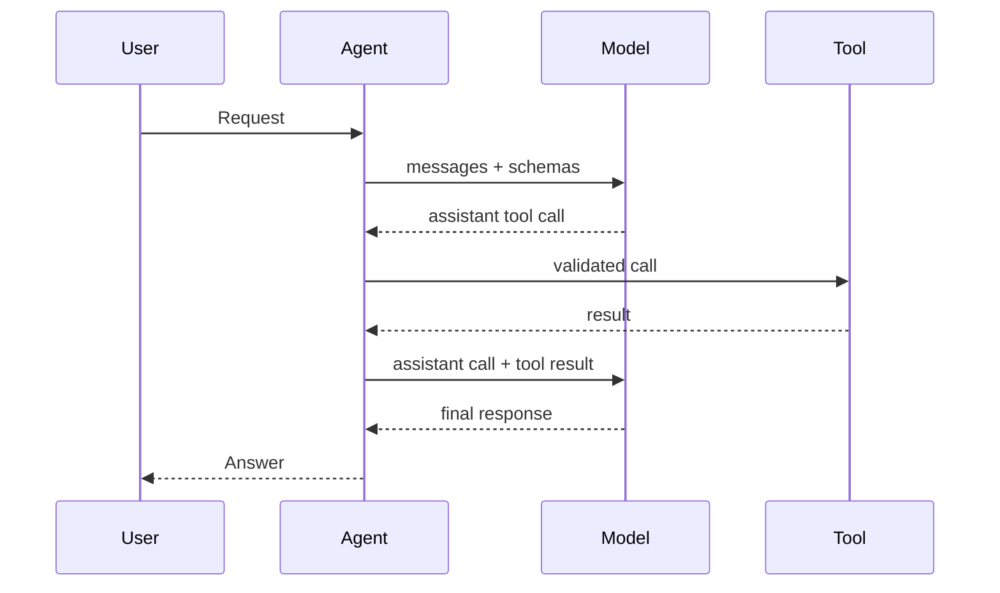

# Agentic Loop Visuals

## The responsibility boundary

```mermaid
flowchart TB
    M[Model] -->|selects a tool and arguments| R[Agent runtime]
    R -->|validates and executes| T[Approved tool]
    T -->|observation| R
    R -->|appends result and re-invokes| M
```

The model proposes. The runtime controls. The tool performs a permitted capability.

## Message lifecycle

```mermaid
sequenceDiagram
    participant U as User
    participant A as Agent
    participant M as Model
    participant T as Tool
    U->>A: Request
    A->>M: messages + schemas
    M-->>A: assistant tool call
    A->>T: validated call
    T-->>A: result
    A->>M: assistant call + tool result
    M-->>A: final response
    A-->>U: Answer
```
