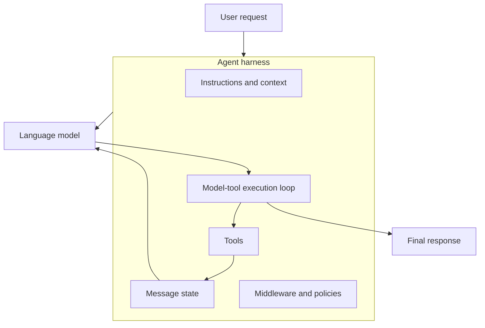

# 2. Agent = Model + Harness

## Start with the distinction

A language model can interpret and generate language. It does not automatically know your policies, have access to your systems, or retain a conversation. An **agent** is a model operating inside a **harness**.

> The harness gets the model the right context at the right time for the task.

Think of a skilled pilot and a cockpit. The pilot supplies judgement; the cockpit supplies the instruments, controls, checklists, and safety constraints that make a flight possible. Replacing the cockpit with a more capable pilot does not create those systems automatically.

## The harness components

| Component | Question it answers | Beginner example |
| --- | --- | --- |
| Model | Who produces the next response or tool choice? | A tool-calling chat model |
| System prompt | How should it behave? | “Be accurate; use the weather tool for weather facts.” |
| Tools | What actions or data can it use? | `get_weather(city)` |
| Message state | What has happened in this interaction? | User request, tool call, tool result, final answer |
| Loop | When does the model get another turn? | After a tool returns data |
| Middleware | What policies shape the run? | Retry, rate limit, PII control, human approval |

## The loop still exists

`create_agent()` does not replace the agentic loop; it packages the standard loop. When the model decides it needs a tool, the harness executes the approved tool, adds the result to state, and asks the model what to do next. It repeats until the model has a final response or another configured stopping condition applies.

## Memory is not automatic

An agent can be entirely stateless. To persist conversation history, you need explicit state persistence—typically a checkpointer and a stable `thread_id`. This is a deliberate storage and lifecycle choice, not a property granted by simply calling `create_agent()`.

## Takeaway

When debugging an agent, ask two questions separately:

1. Was the model capable of choosing the right next action?
2. Did the harness supply the right context, tools, controls, and state?

Next: [Choose the right member of the LangChain family](03-langchain-family-choosing-the-right-layer.md).
