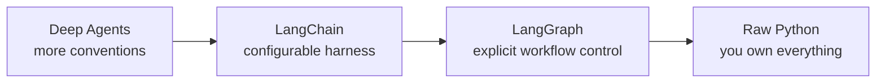

# 3. The LangChain Family: Choosing the Right Layer

These products are complementary. Treating them as names for the same thing leads to poor design decisions.

| Product | Primary responsibility | Choose it when | Do not assume |
| --- | --- | --- | --- |
| **LangChain** | Agent harness and application components | A standard model-and-tools agent is a good fit | It eliminates the need to understand state or provider capability |
| **LangGraph** | Explicit, durable workflow control | You need routing, deterministic steps, parallel paths, approvals, or custom stateful flows | It is “only for experts”; it is about control needs |
| **Deep Agents** | Higher-level ready-made agent patterns | The packaged design matches your task and you accept its conventions | It gives maximum architectural control |
| **LangSmith** | Observability, evaluation, testing, and operations | You need traces and quality/production feedback | It is an agent framework or only works with LangChain |

## A control spectrum

Moving right increases control and implementation responsibility. Moving left increases conventions and speed of assembly. There is no universal “best” layer.

## A practical decision rule

- Begin with **LangChain** when the workflow is a familiar agent loop: a model needs tools, instructions, and standard configuration.
- Use **LangGraph** when the topology itself matters: “route to one of three specialists,” “pause for approval,” “run these two tasks in parallel,” or “resume a durable workflow after interruption.”
- Choose **Deep Agents** when its packaged behavior genuinely matches your use case; inspect its constraints before committing.
- Add **LangSmith** when you need to see the actual model/tool sequence, evaluate behavior, and diagnose cost or latency.

## Correcting two common misconceptions

**“LangGraph is an advanced-only framework.”** Not quite. Its value is explicit control. A small workflow with approval or persistence can justify it earlier than a large but conventional agent.

**“LangSmith monitors only LangChain.”** Not quite. It is a separate observability and evaluation platform, useful beyond one framework.

## Takeaway

Framework choice is a control-versus-convenience decision. Start with the simplest layer that exposes the control your requirements genuinely need.

Next: [Create a reproducible project](04-project-setup-uv-credentials-and-reproducibility.md).
