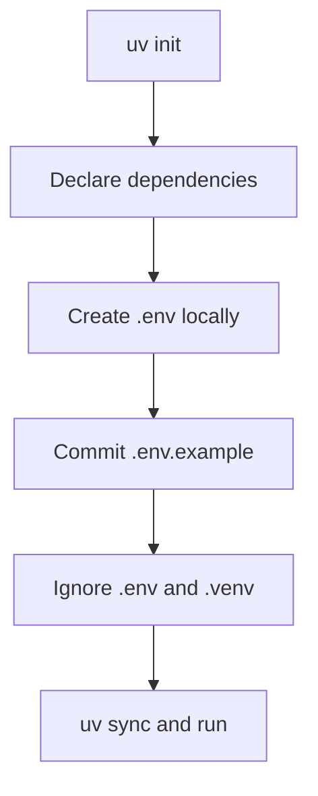

# 4. Project Setup: `uv`, Credentials, and Reproducibility

## Why setup belongs in the lesson

An agent example that runs only on the author’s machine is not a useful engineering artifact. A small project should say what it depends on, how to recreate the environment, and how secrets are supplied without entering source control.

## Minimal setup

```bash
uv init weather-agent
cd weather-agent
uv add langchain langchain-openai python-dotenv
```

For this repository, those choices are already captured in `examples/01_weather_agent/pyproject.toml`.



## Secrets: the safe pattern

| File | Contains | Commit it? |
| --- | --- | --- |
| `.env` | Real local values such as `OPENAI_API_KEY` | No |
| `.env.example` | Variable names and placeholders only | Yes |
| `.gitignore` | Rules that protect `.env` and virtual environments | Yes |
| `pyproject.toml` | Declared dependencies and project metadata | Yes |

For an OpenAI integration, the conventional environment variable is `OPENAI_API_KEY`. Other integrations have their own expected names. The model integration, not LangChain itself, determines the credentials it needs. A local model may need a local server configuration rather than a hosted API key.

## Why `uv`

`uv` uses `pyproject.toml` to declare project dependencies and can create/sync an isolated environment through a single workflow. It keeps setup instructions compact and reproducible. It is not required to understand LangChain; it is simply the package-management choice for these examples.

## Checklist before running

- [ ] You copied `.env.example` to `.env`.
- [ ] The `.env` value is a real key for the selected provider.
- [ ] `.env` is ignored by Git.
- [ ] The selected model supports tool calling.
- [ ] Dependencies were installed with `uv sync`.

## A security correction worth remembering

Deleting a committed secret from the latest file does not necessarily make it safe: Git history, forks, logs, or caches may still contain it. If a key is exposed, revoke or rotate it immediately, then clean the repository history according to your organisation’s process.

Next: [Build and inspect the smallest agent](05-create-agent-smallest-langchain-agent.md).
