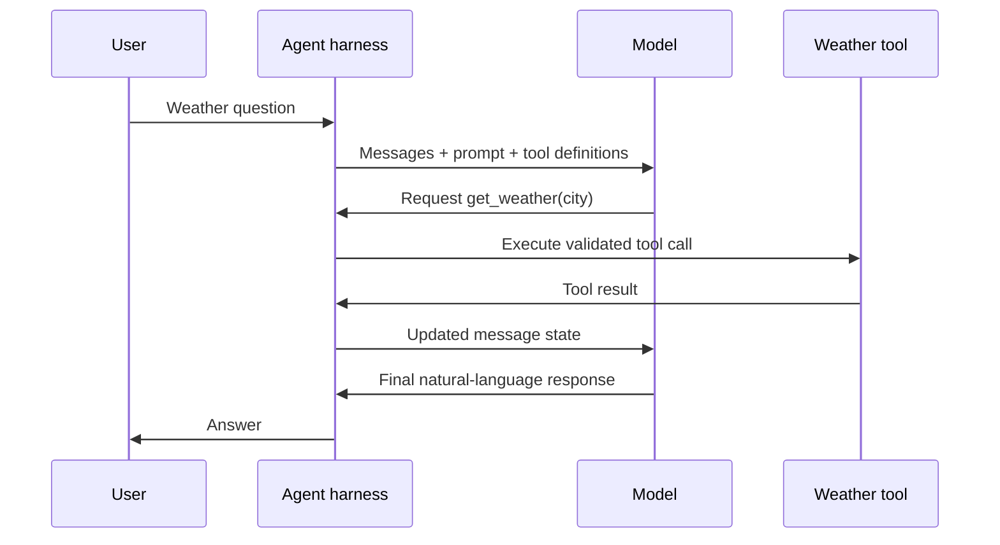

# 5. `create_agent()`: The Smallest Useful LangChain Agent

## The example

The runnable code lives in [`examples/01_weather_agent/main.py`](../examples/01_weather_agent/main.py). Its important lines are:

```python
agent = create_agent(
    model="openai:gpt-5.5",
    tools=[get_weather],
    system_prompt="Use the weather tool when the user asks for weather information.",
)

result = agent.invoke(
    {"messages": [{"role": "user", "content": "What is the weather in Pune?"}]}
)
```

The model name is an example, not a promise that every account can access it. Choose a compatible tool-calling model you can use, then update `MODEL_NAME` in `.env` if needed.

## What each argument means

| Argument | Harness responsibility |
| --- | --- |
| `model` | Selects the model that proposes responses and tool calls |
| `tools` | Exposes approved callable capabilities to the model |
| `system_prompt` | Supplies durable behavioural instructions |
| `invoke()` input | Adds the current user message to the agent’s state |

The tool is a normal Python function with a type-annotated argument and a docstring. LangChain can use that information to describe the tool to the model. The docstring is not decoration; it helps the model decide when the tool is useful.

## What happens during `invoke()`



When the tool is not required, the model may produce a final answer after its first turn. When a tool is required, it can make one or more tool-call iterations. That is why you should print the complete `result["messages"]` during learning: it makes the hidden loop inspectable.

## Important limits of this tiny example

- The weather function is deterministic mock data, not a live weather API.
- It has no persistent memory; a later memory module will add explicit state persistence.
- It has no production error policy, authorization, rate limit, or tracing configuration.
- It assumes a model integration that supports tool calling.

The example is intentionally narrow. Do not mistake a short program for a complete production agent.

Next: [Map the components you will learn in depth](06-agent-components-and-what-comes-next.md).
