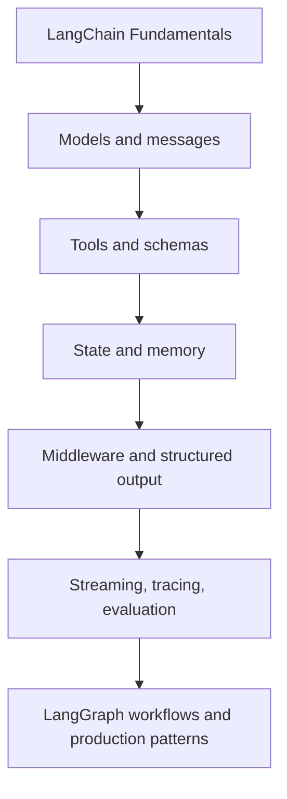

# 6. Agent Components and What Comes Next

`create_agent()` is a useful entry point because it exposes the main seams of an agent harness. This chapter names those seams before future modules study them properly.

| Component | Responsibility | Deeper module question |
| --- | --- | --- |
| Models | Generate messages and tool calls | Which provider and capabilities fit the task? |
| Messages/state | Carry the conversation and tool results | What belongs in context and for how long? |
| Tools | Safely connect actions and data | How do schemas, validation, errors, and permissions work? |
| System prompt | Establish instructions and role | How do we write constraints that are testable? |
| Structured output | Return validated data rather than only prose | When should an agent produce a schema? |
| Memory/checkpointing | Persist or resume state | What should be stored, where, and under which thread identity? |
| Middleware | Apply cross-cutting control | How do retries, guardrails, and dynamic context work? |
| Streaming | Emit useful progress/output | What should the UI reveal to users? |
| Observability | Trace, test, and evaluate behaviour | How do we diagnose cost, latency, and failures? |

## Middleware is broader than hooks around a tool

“Runs before and after a tool” is a helpful first mental model, but not a complete definition. Middleware can shape prompts, model or tool selection, retries, fallbacks, termination, PII controls, rate limits, and guardrails across the agent lifecycle. Use it when a policy applies across runs, not merely inside one business function.

## A sensible forward path

## Final takeaways

- A model supplies language capability; a harness makes that capability usable in a system.
- `create_agent()` is a configurable abstraction over the model–tool loop, not a substitute for understanding the loop.
- State, credentials, provider support, and observability are engineering decisions from the first prototype.
- The next high-leverage topic is **models and messages**, because every agent begins with a model receiving and producing message state.
