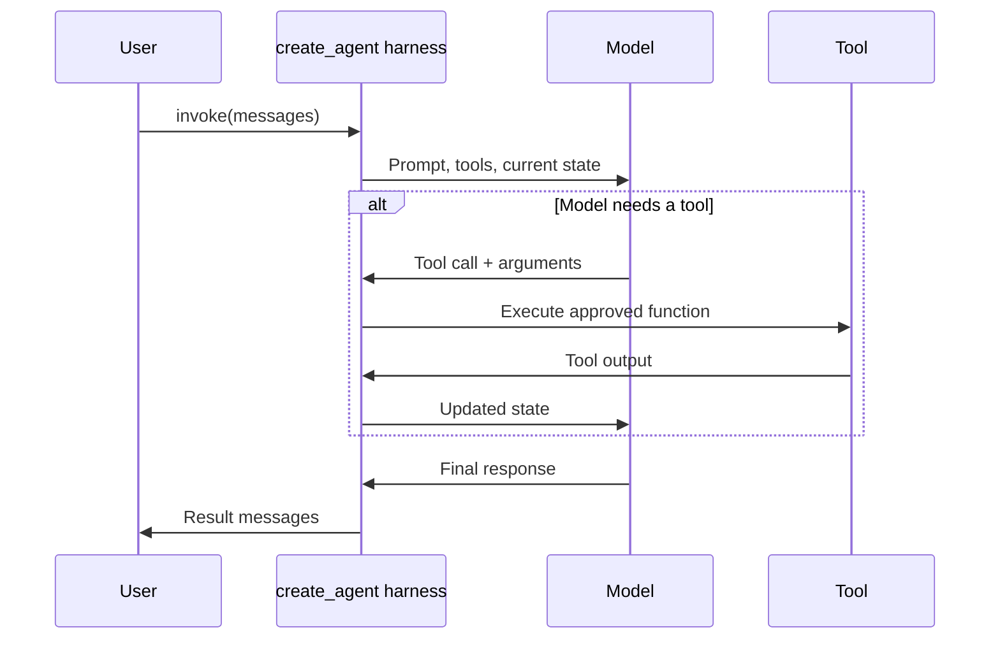

# `create_agent()` Execution Flow

```mermaid
sequenceDiagram
    participant U as User
    participant A as create_agent harness
    participant M as Model
    participant T as Tool
    U->>A: invoke(messages)
    A->>M: Prompt, tools, current state
    alt Model needs a tool
        M->>A: Tool call + arguments
        A->>T: Execute approved function
        T->>A: Tool output
        A->>M: Updated state
    end
    M->>A: Final response
    A->>U: Result messages
```

`create_agent()` makes the orchestration concise; it does not remove the model → tool → model lifecycle.
