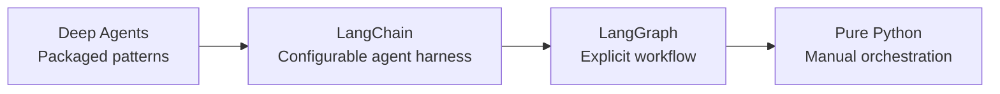

# LangChain Family: Control Spectrum

| Moving toward packaged patterns | Moving toward manual orchestration |
| --- | --- |
| Less boilerplate, more conventions | More control, more responsibility |
| Faster when the pattern fits | Better for custom control flow |

LangSmith sits alongside this spectrum: it is for tracing, evaluation, and operational feedback rather than another execution layer.
