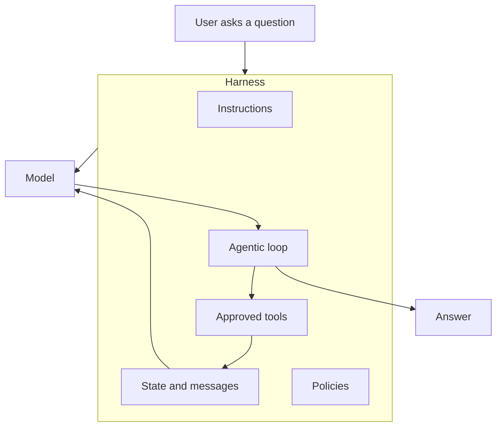

# Model to Agent Harness

```mermaid
flowchart TD
    Q[User asks a question] --> H
    subgraph H[Harness]
        I[Instructions]
        S[State and messages]
        T[Approved tools]
        P[Policies]
        L[Agentic loop]
    end
    H --> M[Model]
    M --> L
    L --> T
    T --> S
    S --> M
    L --> R[Answer]
```

**Read it as:** the model generates the next action; the harness decides what context and approved capabilities surround that action.
