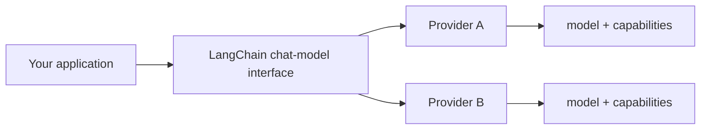

# 01 — One model interface, many providers

## The problem that LangChain is solving

Calling a hosted model directly is easy at first. The friction appears when an application needs consistent code across providers, shared message objects, retry policy, streaming, tool schemas, and response metadata. Every provider still has its own model IDs, authentication, limits, and supported capabilities.

`init_chat_model()` is a convenient factory that gives application code a common chat-model interface:

```python
from langchain.chat_models import init_chat_model

model = init_chat_model("openai:gpt-4.1-mini")
answer = model.invoke("Explain a context window in one sentence.")
print(answer.text)
```

The stable idea is the method contract—such as `.invoke()`, `.stream()`, `.batch()`, and tool binding—not that all providers behave identically.

## A useful mental model



LangChain normalizes *how your code calls the model*. It cannot normalize a capability that a provider does not expose. Tool calls, JSON-schema support, token limits, vision, reasoning controls, and response metadata can differ.

## Setup has two layers

1. **Python integration:** install the core framework plus the integration package for the provider you select.
2. **Provider runtime setup:** configure credentials and, where relevant, endpoint, region, organization, or deployment name.

The logical `model` selector is not the whole runtime configuration. Treat provider setup as environment configuration, not code constants.

## Engineering checklist

- Keep model identifiers in environment/configuration, so they can vary by environment.
- Validate the selected model supports the capabilities the application needs before enabling tools or structured output.
- Log provider/model, request ID (when available), latency, token usage, and failures—without logging secrets or sensitive user content.
- Test a model change with representative prompts; an interface-compatible swap can still change quality, latency, price, and safety behavior.

Next: [configuration](02-configuring-a-model-call.md).
