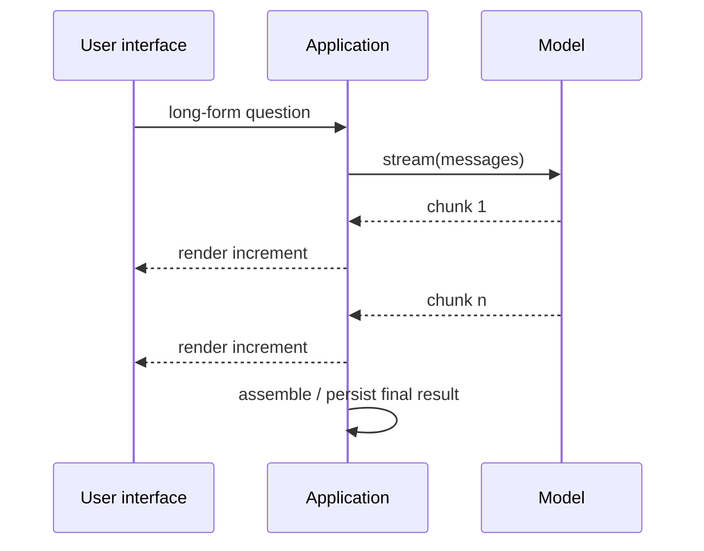

# 04 — Invoke, stream, or batch?

These choices solve different problems. Pick the contract the user experience and workload require.

| Method | Use it when | What arrives | Important limit |
| --- | --- | --- | --- |
| `.invoke(input)` | one response can wait | one complete `AIMessage` | no progressive UI feedback |
| `.stream(input)` | users should see output as it arrives | `AIMessageChunk` increments | usually improves time-to-first-output, not necessarily total completion time |
| `.batch(inputs)` | inputs are independent | ordered collection of completed responses | default implementation is concurrent individual calls, not automatically a provider-native batch discount |
| `.batch_as_completed(inputs)` | independent results can be handled early | completion events/results | yields finished requests, **not** text/token chunks |

## Streaming safely

```python
parts = []
for chunk in model.stream("Explain retry backoff in two sentences."):
    text = chunk.text
    print(text, end="", flush=True)
    parts.append(text)
final_text = "".join(parts)
```

Chunk boundaries are transport/provider increments—not a promise of one token or one word. For a real application, propagate client disconnect/cancellation, set a deadline, and retain/validate the final assembled answer if it must be stored.

## Batching is for independent work

Summarizing 50 separate support tickets is batch-shaped. Answering a follow-up whose meaning depends on the first answer is not. Batch concurrency can hit rate limits, so tune maximum concurrency to your provider quota and add observable failure handling.



Run [the example](../examples/03_invoke_stream_batch.py) to compare the modes.
