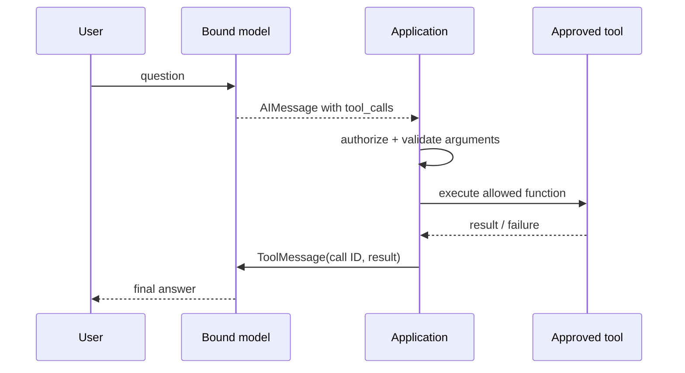

# 05 — Tool binding is not tool execution

Tools let the model request that the application obtain information or take an action. The model does not receive the power to call arbitrary Python simply because a function is passed to `bind_tools()`.

```python
def get_weather(city: str) -> str:
    """Return the current weather for an approved city."""
    return f"Mock weather for {city}: 28°C and clear."

model_with_tools = model.bind_tools([get_weather])
reply = model_with_tools.invoke("What is the weather in Pune?")
print(reply.tool_calls)
```

`bind_tools()` converts the callable/schema into a contract the model can see. The model may return a tool-call request containing a name, arguments, and an ID. It may also choose not to call it.

## The actual boundary



The **application** owns tool registration, authorization, input validation, timeout, error translation, audit logging, and side-effect controls. Treat model-generated arguments as untrusted input. A password-reset or payment tool needs explicit user confirmation and identity/permission checks; a tool description is not a security boundary.

## Returning the result

Use `ToolMessage` and preserve the `tool_call_id` from the AI message. That ID lets the model match the returned result to its request. Do not append a plain string and hope the model infers the relationship.

The [manual-loop example](../examples/04_bind_tools_manual_loop.py) implements only a safe, tiny deterministic dispatcher. Full automatic agent execution belongs in the next module.
