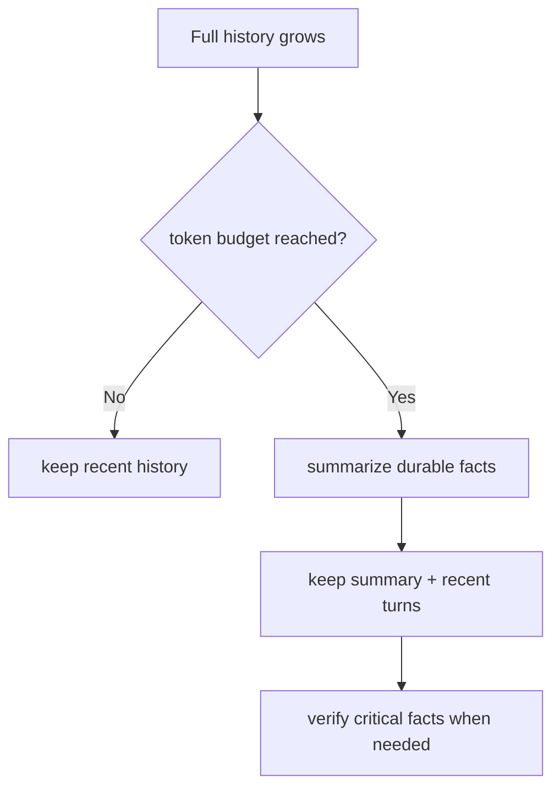

# 06 — Typed output and controlled context

Natural-language text is pleasant for people but unreliable as an input to the next line of application code. Structured output asks the model to return data that fits a schema.

```python
from pydantic import BaseModel, Field

class SupportTriage(BaseModel):
    priority: str = Field(description="one of low, medium, high")
    summary: str
    needs_human: bool

triage_model = model.with_structured_output(SupportTriage)
triage = triage_model.invoke("Customer says their paid account is locked.")
print(triage.priority)
```

## What validation does—and does not—prove

Pydantic validation can establish that the returned value fits the declared type/shape. It does not establish that the model selected the right facts, that the priority follows your business policy, or that the request is authorized. Use normal application validation after parsing.

| Layer | Example question |
| --- | --- |
| Schema validation | Is `needs_human` a Boolean and is `priority` present? |
| Business validation | Is `priority` one of the allowed values for this customer tier? |
| Factual validation | Does the cited order really have the reported status? |
| Authorization | May this user view or change that order? |

Structured-output mechanisms can be provider-native or tool/prompt based depending on the model and integration. Capability support and failure behavior are therefore part of your integration test plan.

## Context compression is a trade-off

Long conversations eventually exceed a useful token budget. One common pattern retains a compact summary plus recent messages. It saves tokens by discarding detail, so the application must decide what facts are non-negotiable: consent, dates, monetary amounts, identifiers, and unresolved commitments often need explicit retention.



Try [structured output](../examples/05_structured_output.py) and the [summary pattern](../examples/06_context_summary_pattern.py). Read the [references](references.md) before treating any API behavior as version-independent.
